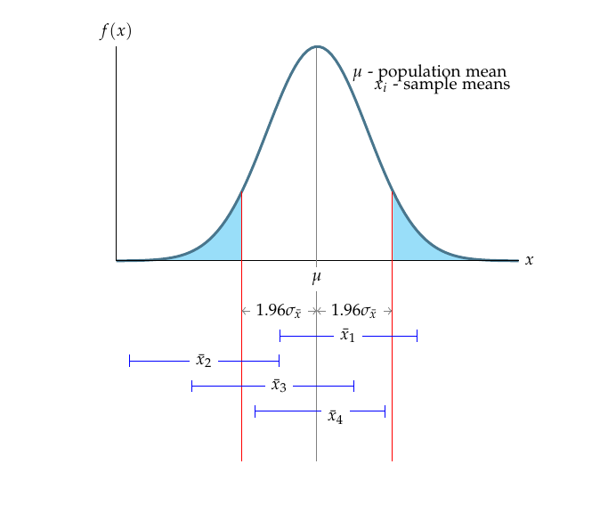
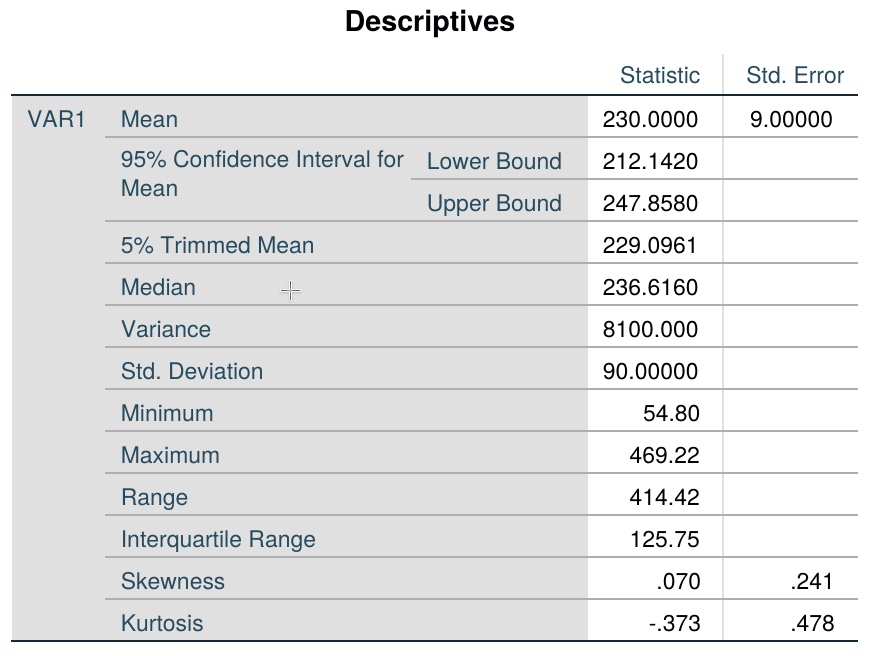
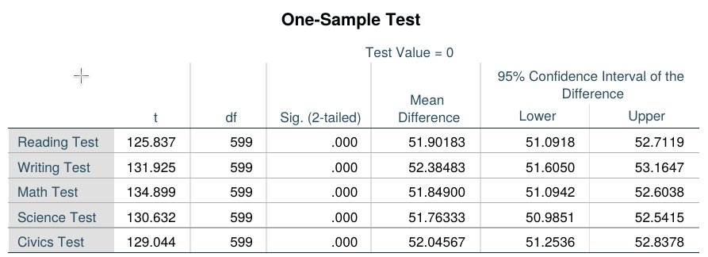
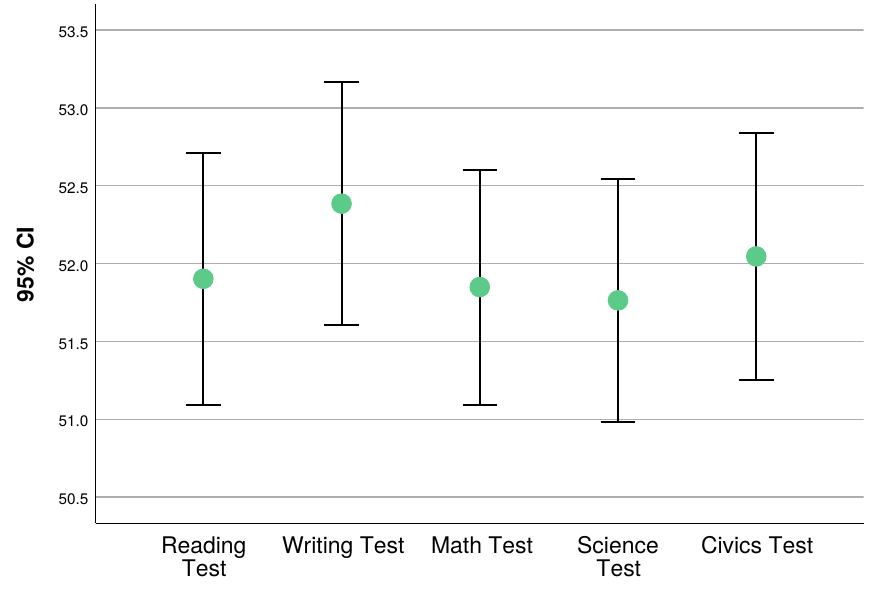
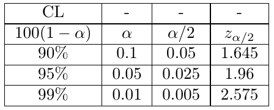
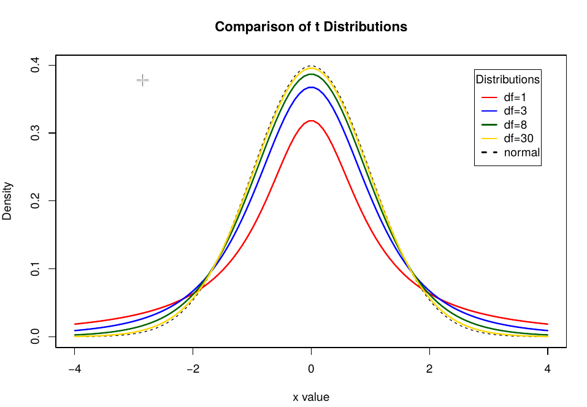
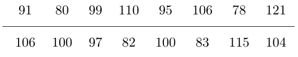

# Confidence Intervals: Large samples

## CI for a $\mu$: Normal $z$-statistic

Let $\theta$ be an unknown parameter. Suppose that on the basis of sample information, random variables $A$ and $B$ are found such that $\mathbb{P}(A < \theta < B) = 1 - \alpha$, where $\alpha$ is any number between $0$ and $1$. If the specific sample values of $A$ and $B$ are $a$ and $b$, then the interval from $a$ to $b$ is called a $100(1-\alpha)\%$ confidence interval (CI) of $\theta$. The quantity $100(1-\alpha)\%$ is called the **confidence level** of the interval.

If the population is repeatedly sampled a very large number of times, the true value of the parameter $\theta$ will be covered by $100(1-\alpha)\%$ of intervals calculated this way. The CI calculated in this manner is written as $a < \theta < b$, with $100(1-\alpha)\%$ confidence.

Let $x_1, x_2, \dots, x_n$ be a random sample of $n$ observations from a normally distributed population with unknown mean $\mu$ and known $\sigma^2$. Suppose that we want a $100(1-\alpha)\%$ CI of the population mean.

Previously, we have seen that,

$$
z = \frac{\bar{x}-\mu}{\sigma/\sqrt{n}}
$$

has a $N(0,1)$ distribution and $z_{\alpha/2}$ is the value from the $N(0,1)$ such that the upper tail probability is $\alpha/2$. We use basic algebra to find,

$$
\begin{aligned}
1 - \alpha &= \mathbb{P} (-z_{\alpha/2} < z < z_{\alpha/2}) \\
&= \mathbb{P} \left(-z_{\alpha/2} < \frac{\bar{x}-\mu}{\sigma/\sqrt{n}} < z_{\alpha/2}\right) \\
&= \mathbb{P} \left(-z_{\alpha/2} \frac{\sigma}{\sqrt{n}} < \bar{x} - \mu < z_{\alpha/2}\frac{\sigma}{\sqrt{n}}\right) \\
&= \mathbb{P} \left(\bar{x}-z_{\alpha/2} \frac{\sigma}{\sqrt{n}} < \mu < \bar{x}+z_{\alpha/2}\frac{\sigma}{\sqrt{n}}\right)
\end{aligned}
$$

According to the Central Limit Theorem, the sampling distribution of the sample mean is approximately normal for large samples. For a $95\%$ confidence level, it follows that,

$$
\mathbb{P} \left(\bar{x}-1.96 \frac{\sigma}{\sqrt{n}} < \mu < \bar{x}+1.96\frac{\sigma}{\sqrt{n}}\right)
$$

The interval $\bar{x} \pm 1.96\sigma_{\bar{x}}$ is called the large sample $95\%$ confidence interval for the population mean $\mu$. The term large sample refers to the sample being of sufficiently large size that we can apply the Central Limit Theory and the normal $z$ statistic to determine the form of the sampling distribution of $\bar{x}$. Empirical research suggests that a sample size $n$ exceeding a value between 20 and 30 will usually yield a sampling distribution of $\bar{x}$ that is normal.

{#fig-1}

If the sample means (e.g., $\bar{x}_1, \bar{x}_3$ and $\bar{x}_4$) fall between the two lines on either side of $\mu$, then the interval $\bar{x} \pm 1.96\sigma_{\bar{x}}$ will contain $\mu$; if $\bar{x}$ falls outside the boundaries (e.g., $\bar{x}_2$), the interval $\bar{x} \pm 1.96\sigma_{\bar{x}}$ will not contain $\mu$.

From the Empirical rule, we know that the area under the normal curve (the sampling distribution of $\bar{x}$) between these boundaries is exactly 0.95. Thus the probability that a randomly selected interval $\bar{x} \pm 1.96\sigma_{\bar{x}}$ will contain $\mu$ is equal to $0.95$ or $95\%$.

Large sample interval estimator requires knowing the value of the population $\sigma$. In most practical applications, the value of population $\sigma$ is unknown. For large samples, in the absence of $\sigma$, sample standard deviation $s$ provides a good approximation to $\sigma$.

## Example

Consider a large bank that wants to estimate the average amount of money owed by its delinquent debtors $\mu$. The bank randomly samples $n=100$ of its delinquent accounts and finds that the sample mean amount owed is $\bar{x}=230$. Also, suppose it is known that the $\sigma$ of the amount owed for all delinquent accounts is $\sigma=90$. Use the interval estimator to calculate the confidence interval for the target parameter $\mu$.

**Solution**  
Substituting $\bar{x}=230$ and $\sigma=90$, assuming $\alpha=0.05$, we obtain:

$$
\begin{aligned}
\bar{x} \pm 1.96 \sigma_{\bar{x}} &= \bar{x} \pm 1.96 \frac{\sigma}{\sqrt{n}} \\
&= 230 \pm (1.96)\left(\frac{90}{\sqrt{100}}\right) = 230 \pm 17.64 \\
&= (212.36, 247.64)
\end{aligned}
$$

If we want to calculate the $95\%$ confidence interval in SPSS using the above statistics, we need to use the simulated dataset `ex3_1.sav`. To calculate the CI, open the dataset, then navigate to **Analyze > Descriptive statistics > Explore**. Select the variable, and under **Display**, check **Statistics** for cleaner output.

{#fig-301}

Can we be sure that $\mu$, the true mean, is in the interval $(212.36, 247.64)$? We cannot be certain, but we can be reasonably confident that it is. This confidence is derived from the fact that if we were to draw repeated random samples of $100$ measurements from this population and form the interval $\bar{x} \pm 1.96\sigma_{\bar{x}}$ each time, $95\%$ of the intervals would contain $\mu$ and $5\%$ would not. The probability, $95\%$, that measures the confidence we can place in the interval estimate is called a *confidence coefficient*. The percentage $95\%$ is called the *confidence level* for the interval estimate. The confidence level reflects our confidence in the estimation process rather than in the particular interval that is calculated from the sample data.

Sometimes, the estimation procedure yields a confidence interval that is too wide for our purpose. In this case, we will want to reduce the width of the interval to obtain a more precise estimate of $\mu$. One way to accomplish this is to decrease the confidence coefficient, $(1-\alpha)$.

## Example: SPSS

As seen in the previous subsection, the output includes other statistics we do not need. Also, for each variable, SPSS generates a separate CI plot, which is not convenient for comparing multiple variables. Therefore, if you want to calculate the CI of multiple variables, it is better to use the `T-TEST` command. For example, to calculate the CI of different test scores in `HSBdata.sav`, navigate to **Analyze > Compare Means > One sample t-test**. From the variable list, select the test score variables and click **Paste**.

This produces the output shown below. The command generates t-test values against a null hypothesis. However, since we are not concerned about the t-test values, we can concentrate on the last two columns. Those two columns show the lower and upper values of the confidence intervals for five variables: Reading Test, Writing Test, Math Test, Science Test, and Civics Test.

{#fig-302}

The confidence interval can also be visualized using the `Errorbar` subcommand under the `Graph` command.

This generates the plot showing confidence intervals across multiple variables:

{#fig-303}

## Commonly used values of $z_{\alpha/2}$

# Confidence Intervals: Small samples

## CI for small samples: Student's $t$ statistic

It is a very common scenario that scientists and statisticians have to use small samples. The use of a small sample in making an inference about $\mu$ presents two immediate problems when we attempt to use the standard normal $z$ as a test statistic.

To solve those problems, instead of using the standard normal statistic,

$$
z = \frac{\bar{x}-\mu}{\sigma_{\bar{x}}} = \frac{\bar{x}-\mu}{\sigma / \sqrt{n}}
$$

which requires knowledge of or a good approximation to $\sigma$, we define and use the statistic,

$$
t = \frac{\bar{x}-\mu}{s / \sqrt{n}}
$$

in which the sample standard deviation replaces the population standard deviation. If we are sampling from a normal distribution, the $t$-statistic has a sampling distribution very much like that of the $z$-statistic: mound-shaped, symmetric, with a mean of zero. The primary difference between $z$ and $t$ is that the latter is more variable than the former, as $t$ contains two random quantities ($\bar{x}$ and $s$), whereas $z$ contains only one ($\bar{x}$).

## Degrees of freedom in $t$ distribution

The actual amount of variability in the sampling distribution of $t$ depends on the sample size $n$. A convenient way of expressing this dependence is to say that the $t$-statistic has $(n-1)$ degrees of freedom (df). The smaller the df, the higher the variability of the sampling distribution.

{#fig-32}

Recall the large sample confidence interval:

$$
\bar{x} \pm z_{\alpha/2}\frac{\sigma}{\sqrt{n}} = \bar{x} \pm z_{0.025}\frac{\sigma}{\sqrt{n}}
$$

where $95\%$ is the desired confidence level. To form the interval for a small sample from a normal distribution, we simply substitute $t$ for $z$ and $s$ for $\sigma$ in the preceding formula:

$$
\bar{x} \pm t_{\alpha/2}\frac{s}{\sqrt{n}}
$$

where $t_{\alpha/2}$ is based on $(n-1)$ degrees of freedom.

Conditions required for a valid small-sample CI from the target population are:

- A random sample is selected from the target population.
- The population has a relative frequency distribution that is approximately normal.

## Example

### Problem
Let's assume a small sample ($n=15$) with $\bar{x}=1.239$ and $s=0.193$. Find the $99\%$ CI. What assumption is required for the calculated CI to be valid?

### Solution
Substituting the above information into the CI formula for small samples, we get:

$$
\bar{x} \pm t_{0.005}\left(\frac{s}{\sqrt{n}}\right) = 1.239 \pm 2.977 \left(\frac{0.193}{\sqrt{15}}\right) = (1.091, 1.387)
$$

So we are $99\%$ confident that we have a mean between $1.091$ and $1.387$. Our confidence is derived from the fact that $99\%$ of the intervals formed in repeated applications of the procedure would contain $\mu$.

## Example: SPSS

The following sample of 16 measurements was selected from a population that is approximately normally distributed:

Construct the $80\%$ confidence interval for the population mean.

We need to enter the above data into SPSS in a single column and use the procedure outlined for the large sample example, adjusting the confidence interval value to 80%.

The resulting output shows that the $80\%$ confidence interval is $[93.7, 102.18]$. That is, we are $80\%$ confident that the true population mean lies in the interval 93.7 to 102.18.
