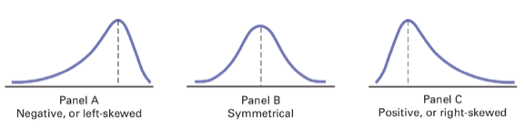

# Measures of central Tendency

## Arithmetic mean

The arithmetic mean, or mean of a set of measurements is defined to be the sum of measurements divided by the total number of measurements.

Usually, the population mean is denoted by $\mu$ and the sample mean is denoted by $\bar{y}$. The sample mean of a series is defined as,

$$
\bar{y}=\frac{\sum_iY_i}{n}
$$

where, $n$ is the number of observations.

Example A sample of $n=15$ overdue accounts in a large department store yields the following amounts due,

|       |        |        |
|-------|--------|--------|
| 55.2  | 4.88   | 271.95 |
| 18.06 | 180.29 | 365.29 |
| 28.16 | 399.11 | 807.8  |
| 44.14 | 97.47  | 9.98   |
| 61.61 | 56.89  | 82.73  |

The sample mean is computed as follows,

$$
\bar{y}= \frac{\sum_iY_i}{n}=\frac{55.20+18.06+ .... + 82.73}{15}=\frac{2483.56}{15}=165.57
$$

### Some comments about the arithmetic mean

- It is the most common central tendency measure
- There exist only one mean of a dataset/series
- The value of the mean is influenced by the extreme values. Trimming or deleting extreme observations helps to reduce/omit that influence
- Means of samples from a single population can be combined to get the population mean.
- It is applicable to quantitative data only.

## Median

The median of a set of measurements is defined to be the middle value when the measurements are arranged from lowest to highest. So, first we need to sort the dataset from lowest to highest.

$$
y_1 \leq y_2 \leq y_3 \leq .... \leq y_i \leq .. \leq y_n
$$

Then, the median of a series will be,

- $\frac{N+1}{2}$-th observation if $n$ is odd.
- Average of $\left(\frac{N}{2}\right)$ and $\left(\frac{N}{2}+1\right)$-th observation if $n$ is even.

### Median: some comments

- It is the central value, 50 percent of the observations lie above it and the rest fall below it.
- There is only one median in a dataset
- It is not affected by extreme observations
- Medians of subsamples cannot be combined to get the median of the population.
- It is applicable to quantitative data only
- For group data, its value is rather stable even when the data are organized into different categories.

## Mode

A mode of a set of measurements is defined to be the measurement that occurs most often, i.e. the highest frequency.

### Mode: some comments

There can be more than one mode in a dataseries. Modes of the subsamples cann't be used to determine to formulate the mode of the population It is applicable for both qualitative and quantitative data For grouped data, its value can change depending on the categories used.

## Relationship: mean, Median, Mode

- When a variable is normally distributed, the mean, median, and mode are the same number.
- When the variable is skewed to the left (i.e., negatively skewed), the mean shifts to the left the most, the median shifts to the left the second most, and the mode the least affected by the presence of skew in the data.
- When the variable is skewed to the right (i.e., positively skewed), the mean is shifted to the right the most, the median is shifted to the right the second most, and the mode the least affected.



# Measures of dispersion

## Range

The range of a set of measurements is defined to be the difference between the largest and the smallest measurements of the set.

From the above dataset we are working on, the smallest values is 4.88 and the largest is 807.80. The range of the data would be,

$$
range = 807.80 - 4.88 = 802.92
$$

## Variance and standard deviation

The *variance* of a set of measurements $y_1, y_2, y_3, .... , y_n$, with a mean of $\bar{y}_n$ is the sum of the squared deviations divided by $n-1$. Symbolically,

$$
s^2 = \frac{\sum_{i=1}^n(x_i-\bar{x})^2}{n-1}
$$

We are assuming, we are working with **samples**. In case of \textit{population} variance we will replace $n-1$ with $n$ in the denominator. Sample variance is denoted by $s^2$ and the population variance is denoted by $\sigma^2$.

Sample variance is an *unbiased estimator* of the population variance. That means, if we take different sub-samples from the population, then the average variance of those samples are (roughly) equal to the population variance.

The **standard deviation** is a set of measurements is defined to be the positive square root of the variance. $$
s = \sqrt{\frac{\sum_{i=1}^n(x_i-\bar{x})^2}{n-1}}
$$

As mentioned before, sample standard deviation will be denoted by $s$ and the population standard deviation is denoted by $\sigma$. In real life, this difference is often ignored.

### Variance and standard deviation: Example

| Product | Calories |
|------------------------------------|------------------------------------|
| Dunkin's Donuts Iced Mocha Swirl latte (whole milk) | 240 |
| Starbucks coffee frappuccino blended coffee | 260 |
| Dunkin Donuts coffee coolatta | 350 |
| Starbucks Iced Coffee Mocha Espresso (whole Milk and whipped cream | 350 |
| Starbucks Mocha Flappuccino blended coffee (whipped cream) | 420 |
| Starbucks Chocolate Brownie Flappuccino blended coffee (whipped cream) | 510 |
| Starbucks Chocolate Flappuccino blended creme (whipped cream | 530 |

: Calories in different Starbucks drinks

To calculate standard deviation and variance first we need to calculate the mean, then the squared differences

$$
\bar{x} = \frac{\sum_{i=1}^nX_i}{n} = \frac{2660}{7} = 380
$$

| Calories | $(x_i - \bar{x})$ | $(x_i - \bar{x})^2$ |
|----------|-------------------|---------------------|
| 240      | -140              | 19600               |
| 260      | -120              | 14400               |
| 350      | -30               | 900                 |
| 350      | -30               | 900                 |
| 420      | 40                | 1600                |
| 510      | 130               | 16900               |
| 530      | 150               | 22500               |
|          |                   | 76800               |

Putting all into the formula, we can get the variance.

$$
s^2 = \frac{\sum_{i=1}^n(x_i-\bar{x})^2}{n-1} = \frac{76800}{6} =  12800 
$$\
And, the standard deviation is,

$$
s = \sqrt{s^2} = \sqrt{12800} = 113.1371
$$

### Characteristics of deviation measures

- The greater the spread or dispersion of the data, the larger the range, $\sigma^2$ and $\sigma$.
- The greater the concentration of the data around the central value, the smaller the range, $\sigma^2$ and $\sigma$.
- If the values are all the same (so that there are no variation in the data), the range, $\sigma^2$ and $\sigma$ will all equal to zero.
- None of the measures of variation can *ever* be negative.

## The coefficient of variation

Unlike the range, $\sigma$ and $\sigma^2$, the coefficient of variation is a relative measure expressed as a percentage rather than units of a particular data. The coefficient of variation is equal to the standard deviation by the mean, multiplied by $100\%$.

$$
CV = \left(\frac{\sigma}{\bar{x}}\right)\times 100\%
$$

The coefficient of variation is particularly useful to compare the variability of two different datasets measured in two different units of measurements.

From the previous Starbucks data, the coefficient of variation can be calculated as,

$$
CV = \left(\frac{s}{\bar{x}}\right)\times 100\% = \frac{113.1371}{380} \times 100\% = 28.79\%
$$

# Confidence Intervals

The goal here is to estimate the sample information to estimate the population parameter of interest to assess the reliability of the estimate.

- The unknown population parameter (e.g. mean or proportion) that we are interested in estimating is called *target parameter*}.
- A *point estimator* of a population is a rule or formula that tells us how to use the sample data to calculate as single number that can be used as an estimate of the target parameter.
- An *interval estimator or confidence interval* is a formula that tells us how to use the sample data to calculate an interval that estimates the target parameter.

## Confidence interval: large sample

**CI for a** $\mu$: Normal $z$-statistic

Let $x_1, x_2, ... , x_n$ be a random sample of $n$ observations from a normally distributed population with unknown mean $\mu$ and known $\sigma^2$. Suppose that, we want a $100(1-\alpha)\%$ CI of the population mean. Previously, we saw that,

$$
z = \frac{\bar{x}-\mu}{\sigma/\sqrt{n}}
$$

has a $N(0,1)$ distribution and $z_{\alpha/2}$ is the value from the $N(0,1)$ such that the upper tail probability is $\alpha/2$. We use the basis algebra to find,

$$
1 - \alpha =  \mathbb{P} (-z_{\alpha/2} < z < z_{\alpha/2}) = \mathbb{P} \left(-z_{\alpha/2} < \frac{\bar{x}-\mu}{\sigma/\sqrt{n}} < z_{\alpha/2}\right)
$$

which in turn,

$$
\mathbb{P} \left(-z_{\alpha/2} \frac{\sigma}{\sqrt{n}} < \bar{x} - \mu < z_{\alpha/2}\frac{\sigma}{\sqrt{n}}\right)
= \mathbb{P} \left(\bar{x}-z_{\alpha/2} \frac{\sigma}{\sqrt{n}} < \mu < \bar{x}+z_{\alpha/2}\frac{\sigma}{\sqrt{n}}\right)
$$

## Central limit theorem

According to the Central Limit Theorem the sampling distribution of the sample mean is approximately normal for large samples. For a $95\%$ confidence level it follows that,

$$
\mathbb{P} \left(\bar{x}-1.96 \frac{\sigma}{\sqrt{n}} < \mu < \bar{x}+1.96\frac{\sigma}{\sqrt{n}}\right)
$$

The interval $\bar{x} \pm 1.96\sigma_{\bar{x}}$ is called the large sample $95\%$ confidence interval for the population mean $\mu$. The term large sample refers to the sample being of sufficiently large size that we can apply the Central Limit Theory and the normal $z$ statistic to determine the form of the sampling distribution of $\bar{x}$. Empirical research suggests that a sample size $n$ exceeding a value between 20 and 30 will usually yield a sampling distribution of $\bar{x}$, that is normal.

If the sample means (e.g. $\bar{x}_1, \bar{x}_3$ and $\bar{x}_4$) falls between the two lines on either side of $\mu$, then the interval $\bar{x} \pm 1.96\sigma_{\bar{x}}$ will contain $\mu$; if $\bar{x}$ falls outside the boundaries (e.g. $\bar{x}_2$), the interval $\bar{x} \pm 1.96\sigma_{\bar{x}}$ will not contain $\mu$.\\ \vspace{0.2cm} From the Empirical rule, we know that, the area under the normal curve (the sampling distribution of $\bar{x}$ between these boundaries is exactly 0.95. Thus the probability that a randomly selected interval $\bar{x} \pm 1.96\sigma_{\bar{x}}$, will contain $\mu$ is equal to $0.95$ or $95\%$.\\ \vspace{0.2cm} Large sample interval estimator requires knowing the value of the population $\sigma$. In most practical applications, the value of population $\sigma$ is unknown. For large samples, in the absence of $\sigma$, sample standard deviation $s$ provides a good approximation to $\sigma$.

# Covariance and correlation

Covariance is a measure of the relationship between two random variables. The metric evaluates how much - to what extent - the variables change together. In other words, it is essentially a measure of the variance between two variables. However, the metric does not assess the dependency between variables.

$$
Cov (x, y) = \frac{\sum(x_i - \bar{x})(y_i - \bar{y})}{n}
$$

For a sample covariance, we need to deduct 1 from the demoninator, i.e. $(n-1)$.

- Positive covariance: Indicates that two variables tend to move in the same direction.
- Negative covariance: Reveals that two variables tend to move in inverse directions.

Using covariance, we can only gauge the direction of the relationship (whether the variables tend to move in tandem or show an inverse relationship). However, it does not indicate the strength of the relationship, nor the dependency between the variables.

Correlation measures the strength of the relationship between variables. Correlation is the scaled measure of covariance. It is dimensionless. In other words, the correlation coefficient is always a pure value and not measured in any units.

$$
\rho = \frac{cov(x, y)}{\sigma_x \sigma_y}
$$

- Correlation value ranges from $-1$ to $+1$. The correlation of zero indicates zero relationship.
- $\rho_{x,y} = \rho_{y,x}$
- The correlation is not synonimous to causation!
- More on this topic will be covered later in the degree program.

## Percentiles

The $p$-th percentile of a set of $n$-measurements arranged in order of magnitude is that value that has at most $p\%$ of the measurements below it and at most $(100-p)\%$ above it.

Percentiles are frequently used to describe the results of achievements test scores and the ranking of a person in comparison to the rest of the people taking the examination. Specific percentile of interest are the 25th, 50th and 75th percentiles; often called the lower quantile, the middle quantile (median) and the upper quantile respectively. Similarly, if we divide the data by 10 parts then we refer every part as *deciles*.

# Descriptive Statistics using Graphics

Graphical representations of data provide intuitive visual summaries of distributions, patterns, trends, and relationships. Unlike numerical descriptive measures (such as mean or standard deviation), graphical methods allow researchers to quickly spot outliers, skewness, multimodal behavior, and temporal trends.

## Barplot

**Definition:** A **barplot** (or bar chart) is a graphical display that represents categorical data using rectangular bars, where the length or height of each bar is proportional to the count, frequency, or percentage of observations falling into each category.

```{r}
#| echo: false
#| message: false
#| warning: false
#| fig-width: 7
#| fig-height: 4.5
#| fig-align: center

library(ggplot2)

set.seed(42)
df_bar <- data.frame(
  Category = c("Product A", "Product B", "Product C", "Product D", "Product E"),
  Sales = c(120, 240, 180, 310, 150)
)

ggplot(df_bar, aes(x = reorder(Category, -Sales), y = Sales, fill = Category)) +
  geom_col(show.legend = FALSE, width = 0.55) +
  geom_text(aes(label = Sales), vjust = -0.5, size = 3.8, fontface = "bold") +
  scale_fill_brewer(palette = "Set2") +
  labs(
    title = "Annual Sales Volume by Product Category",
    x = "Product Category",
    y = "Sales Units"
  ) +
  scale_y_continuous(expand = expansion(mult = c(0, 0.15))) +
  theme_minimal(base_size = 12) +
  theme(
    plot.title = element_text(face = "bold", hjust = 0.5),
    panel.grid.major.x = element_blank()
  )
```

## Time series plot

**Definition:** A **time series plot** is a line chart where observations recorded sequentially over regular time intervals are plotted against time on the horizontal axis. It is used to analyze patterns such as secular trends, seasonality, cyclical fluctuations, and irregular variations over time.

```{r}
#| echo: false
#| message: false
#| warning: false
#| fig-width: 7.5
#| fig-height: 4.5
#| fig-align: center

set.seed(42)
dates <- seq.Date(from = as.Date("2024-01-01"), to = as.Date("2025-12-01"), by = "month")
trend <- seq(100, 260, length.out = length(dates))
seasonality <- 25 * sin(seq(0, 4 * pi, length.out = length(dates)))
noise <- rnorm(length(dates), mean = 0, sd = 7)
df_ts <- data.frame(Date = dates, Revenue = trend + seasonality + noise)

ggplot(df_ts, aes(x = Date, y = Revenue)) +
  geom_line(color = "#2b5c8f", linewidth = 1) +
  geom_point(color = "#2b5c8f", size = 2.2) +
  geom_smooth(method = "loess", se = FALSE, color = "#e74c3c", linetype = "dashed", linewidth = 0.8) +
  scale_x_date(date_breaks = "3 months", date_labels = "%b %Y") +
  labs(
    title = "Monthly Business Revenue Trend (2024 - 2025)",
    subtitle = "Solid line represents monthly figures; dashed red line shows smoothed trend",
    x = "Timeline (Months)",
    y = "Revenue (in $1,000s)"
  ) +
  theme_minimal(base_size = 12) +
  theme(
    plot.title = element_text(face = "bold", hjust = 0.5),
    plot.subtitle = element_text(hjust = 0.5, color = "gray30", size = 10),
    axis.text.x = element_text(angle = 45, hjust = 1)
  )
```

## Stacked bar plot

**Definition:** A **stacked bar plot** extends a standard bar plot by dividing each bar into sub-bars representing sub-categories within the main category. It allows simultaneous comparison of total quantities and internal compositions.

- **Normal (Absolute) Stacked Bar Plot:** Displays the raw counts or values stacked vertically. The height of the entire bar represents the total aggregate frequency across all sub-categories.
- **100% Stacked Bar Plot:** Normalizes every bar to 100% (or proportion 1.0). Each sub-bar represents the relative percentage contribution of that sub-category within its parent group, making it easy to compare proportion structures regardless of differing total group sizes.

```{r}
#| echo: false
#| message: false
#| warning: false
#| fig-width: 9.5
#| fig-height: 4.5
#| fig-align: center

library(patchwork)
library(scales)

set.seed(42)
df_stacked <- expand.grid(
  Department = c("Sales", "R&D", "Marketing", "HR"),
  Satisfaction = c("Low", "Medium", "High")
)
df_stacked$Satisfaction <- factor(df_stacked$Satisfaction, levels = c("Low", "Medium", "High"))
df_stacked$Count <- c(15, 30, 55,  10, 40, 70,  20, 35, 25,  5, 25, 20)

p1 <- ggplot(df_stacked, aes(x = Department, y = Count, fill = Satisfaction)) +
  geom_col(position = "stack", width = 0.55) +
  scale_fill_brewer(palette = "Set2") +
  labs(
    title = "Standard (Absolute) Stacked Bar Plot",
    x = "Department",
    y = "Number of Employees",
    fill = "Satisfaction Level"
  ) +
  theme_minimal(base_size = 11) +
  theme(
    plot.title = element_text(face = "bold", hjust = 0.5),
    legend.position = "bottom"
  )

p2 <- ggplot(df_stacked, aes(x = Department, y = Count, fill = Satisfaction)) +
  geom_col(position = "fill", width = 0.55) +
  scale_y_continuous(labels = scales::percent) +
  scale_fill_brewer(palette = "Set2") +
  labs(
    title = "100% Stacked Bar Plot",
    x = "Department",
    y = "Proportion (%)",
    fill = "Satisfaction Level"
  ) +
  theme_minimal(base_size = 11) +
  theme(
    plot.title = element_text(face = "bold", hjust = 0.5),
    legend.position = "bottom"
  )

p1 + p2 + plot_layout(guides = "collect") & theme(legend.position = "bottom")
```

## Histogram and density plot

A **histogram** is a graphical display of the probability distribution of a continuous quantitative variable. The range of values is divided into a series of contiguous, non-overlapping intervals called **bins**. The height of each rectangle corresponds to the frequency or density of data points falling into that bin.

```{r}
#| echo: false
#| message: false
#| warning: false
#| fig-width: 7
#| fig-height: 4.5
#| fig-align: center

set.seed(42)
scores <- rnorm(500, mean = 72, sd = 10)
df_hist <- data.frame(Score = scores)

ggplot(df_hist, aes(x = Score)) +
  geom_histogram(aes(y = after_stat(density)), bins = 25, fill = "#3498db", color = "white", alpha = 0.85) +
  geom_density(color = "#e74c3c", linewidth = 1.1) +
  labs(
    title = "Distribution of Student Exam Scores",
    subtitle = "Histogram with overlaid kernel density estimation (Red Curve)",
    x = "Exam Score",
    y = "Density"
  ) +
  theme_minimal(base_size = 12) +
  theme(
    plot.title = element_text(face = "bold", hjust = 0.5),
    plot.subtitle = element_text(hjust = 0.5, color = "gray30", size = 10)
  )
```

A histogram visualizes the frequency of data within pre-specified numerical ranges ("bins"). Because bin widths can heavily influence the visual output, histograms display a discrete representation of raw counts.

A density plot is a smooth, continuous curve representing the probability density function (PDF) of the underlying data. It estimates the probability of a random variable falling within a given range, where the total area under the density curve equals $1$.

```{r}
#| echo: false
#| message: false
#| warning: false
#| fig-width: 7
#| fig-height: 4.5
#| fig-align: center

# Simulate skewed continuous data
sim_data <- data.frame(Value = rgamma(500, shape = 3, scale = 2))

# Histogram followed by Density Plot
ggplot(sim_data, aes(x = Value)) +
  geom_histogram(aes(y = after_stat(density)), bins = 30, fill = "#69b3a2", color = "white", alpha = 0.6) +
  geom_density(color = "#e74c3c", linewidth = 1.2) +
  theme_minimal() +
  labs(
    title = "Continuous Density Estimate Overlaid on Histogram",
    x = "Simulated Values",
    y = "Density"
  )
```

## Q-Q plot

A **Quantile-Quantile (Q-Q) plot** is a diagnostic scatter plot used to assess whether an empirical sample dataset originates from a theoretical reference distribution (most commonly the Normal Distribution). It plots the empirical sample quantiles on the vertical axis against the theoretical quantiles on the horizontal axis. If the dataset follows the assumed distribution, the points will fall closely along the 45-degree reference line ($y = x$).

```{r}
#| echo: false
#| message: false
#| warning: false
#| fig-width: 7
#| fig-height: 4.5
#| fig-align: center

set.seed(42)
sample_norm <- rnorm(200, mean = 50, sd = 10)
df_qq <- data.frame(Value = sample_norm)

ggplot(df_qq, aes(sample = Value)) +
  stat_qq(color = "#2c3e50", alpha = 0.7, size = 2) +
  stat_qq_line(color = "#e74c3c", linewidth = 1, linetype = "dashed") +
  labs(
    title = "Normal Q-Q Plot of Sample Data",
    subtitle = "Points closely following the red dashed line confirm approximate normality",
    x = "Theoretical Normal Quantiles",
    y = "Sample Quantiles"
  ) +
  theme_minimal(base_size = 12) +
  theme(
    plot.title = element_text(face = "bold", hjust = 0.5),
    plot.subtitle = element_text(hjust = 0.5, color = "gray30", size = 10)
  )
```

## Box whisker plot

**Definition:** A **box-whisker plot** (or boxplot) provides a concise visual summary of a continuous variable's distribution based on its five-number summary: minimum, first quartile ($Q_1$), median ($Q_2$), third quartile ($Q_3$), and maximum.

```{r}
#| echo: false
#| message: false
#| warning: false
#| fig-width: 7.5
#| fig-height: 4.5
#| fig-align: center

set.seed(42)
df_box <- data.frame(
  Group = factor(rep(c("Group A", "Group B", "Group C"), each = 60)),
  Value = c(
    rnorm(58, mean = 50, sd = 8), 78, 20,
    rnorm(60, mean = 65, sd = 6),
    rnorm(59, mean = 42, sd = 11), 85
  )
)

ggplot(df_box, aes(x = Group, y = Value, fill = Group)) +
  geom_boxplot(alpha = 0.7, outlier.color = "#e74c3c", outlier.shape = 16, outlier.size = 2.5, width = 0.5) +
  geom_jitter(width = 0.12, alpha = 0.25, color = "black") +
  scale_fill_brewer(palette = "Set2") +
  labs(
    title = "Comparative Box-Whisker Plot Across Groups",
    x = "Group Category",
    y = "Observed Value",
    fill = "Group"
  ) +
  theme_minimal(base_size = 12) +
  theme(
    plot.title = element_text(face = "bold", hjust = 0.5),
    legend.position = "none"
  )
```

### Explanation of Box-Whisker Components

1. **The Central Box (Interquartile Range - IQR):**
   - The lower edge of the box represents the **First Quartile ($Q_1$ / 25th percentile)**.
   - The upper edge represents the **Third Quartile ($Q_3$ / 75th percentile)**.
   - The span between $Q_1$ and $Q_3$ is the **Interquartile Range ($IQR = Q_3 - Q_1$)**, which contains the central 50% of the data.

2. **The Median Line ($Q_2$):**
   - The line drawn across the inside of the box marks the **Median (50th percentile)**.
   - A median centered within the box suggests a symmetric distribution; a median closer to $Q_1$ indicates positive (right) skewness, while a median closer to $Q_3$ indicates negative (left) skewness.

3. **Whiskers:**
   - Lines extending from the top and bottom of the box are called **whiskers**.
   - By default (Tukey boxplot convention), whiskers extend to the furthest data points within $1.5 \times IQR$ from $Q_1$ and $Q_3$:
     $$\text{Lower Whisker Limit} = Q_1 - 1.5 \times IQR$$
     $$\text{Upper Whisker Limit} = Q_3 + 1.5 \times IQR$$

4. **Outliers:**
   - Data points located beyond the whiskers (less than $Q_1 - 1.5 \times IQR$ or greater than $Q_3 + 1.5 \times IQR$) are identified as **outliers** and plotted individually as distinct points (highlighted in red above).