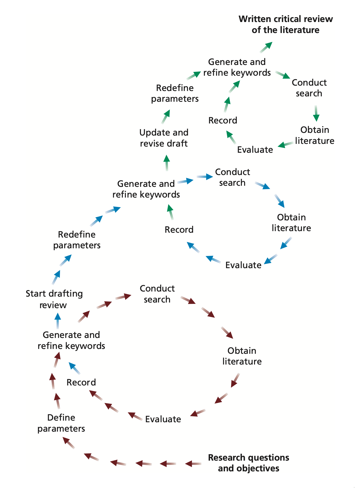
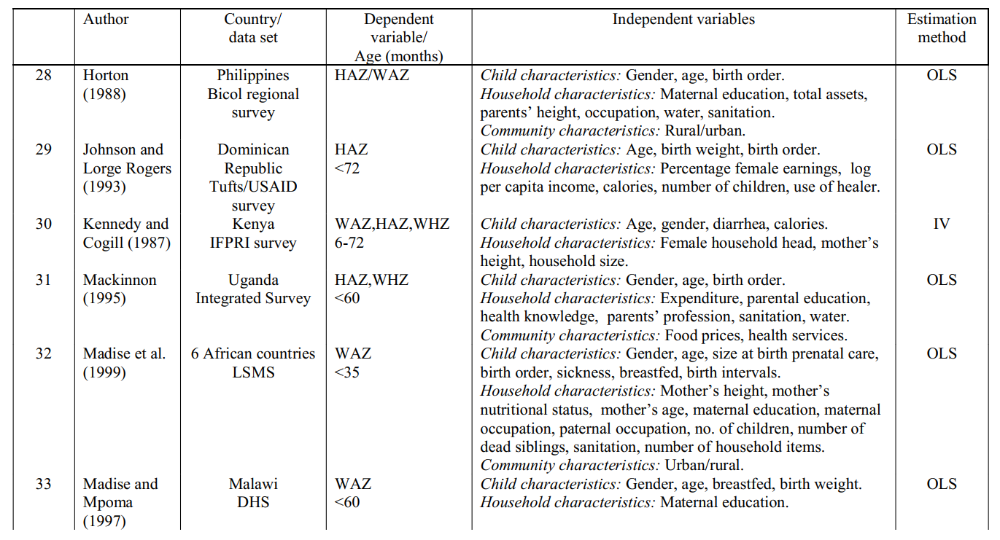
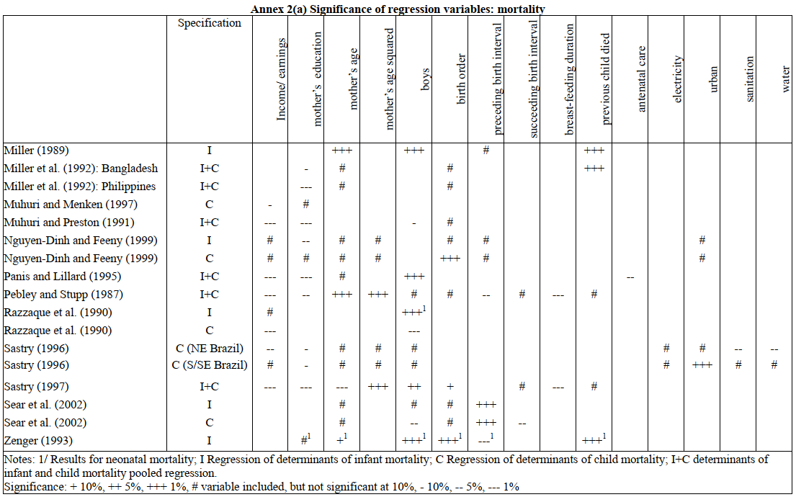
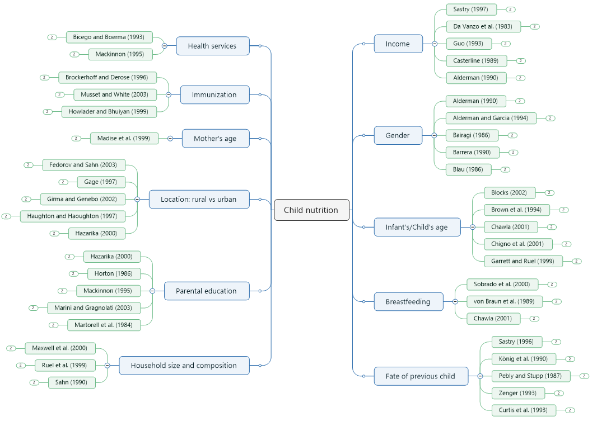

# Literature review

## A continuous process

After setting up the research question and hypotheses, we need to see what others did in the same subject area. This process is called literature review. There are several objectives of literature review:

-   To see what methodologies are appropriate for the analysis
-   To understand the gaps in the field
-   To know the improvement suggestions from other researchers

The literature review can be started while setting up the research question and hypotheses and can continue till the end of the research project. This is because, the research process is often very long and it is important to get updated with publications during ongoing research project. Graphically, it may look like this,

{#fig-lit_revprocess}

## Purpose of critical review

The precise purpose of your reading of the literature will depend on the approach you are intending to use in your research.

For some research projects it is necessary to use the literature to help you to identify theories and ideas that you will test using data. This is known as a *deductive approach* in which researcher develop a theoretical or conceptual framework, which is to be subsequently tested using data.

For other research projects the researcher will be planning to explore the data and to develop theories which will be subsequently related to the literature. This is known as an *inductive approach* and, although researchers still has a clearly defined purpose with research question(s) and objectives, the researchers do not start with any predetermined theories or conceptual frameworks.

The literature review has a number of other purposes. It can be,

-   to help the researcher to refine the research question(s) and objectives further
-   to highlight research possibilities that have been overlooked implicitly in research to date
-   to discover explicit recommendations for further research. These can provide you with a superb justification the researchers' own research question(s) and objectives
-   to help the researcher to avoid simply repeating work that has been done already
-   to sample current opinions in newspapers, professional and trade journals, thereby gaining insights into the aspects of your research question(s) and objectives that are considered newsworthy;
-   to discover and provide an insight into research approaches, strategies and techniques that may be appropriate to your own research question(s) and objectives.

## Content of critical review

In considering the content of the critical review, the researcher will therefore need:

-   to include the key academic theories within your chosen area of research;
-   to demonstrate that your knowledge of your chosen area is up to date;
-   through clear referencing, enable those reading your project report to find the original publications which you cite.

## Literature sources

### Steps in Literature review

### Summarizing findings

We can start collecting and summarizing the literature in excel spreadsheets.

Summary findings can be organized in the spreadsheet too.

Another approach could be using [mindmap](https://www.google.com/search?q=mindmap&newwindow=1&sxsrf=AOaemvIoVQqJYRE2wdmDFQkpsamskwwelA:1632123735585&source=lnms&tbm=isch&sa=X&sqi=2&ved=2ahUKEwiDofTbho3zAhVXFlkFHXsdBj4Q_AUoAXoECAEQAw&biw=1745&bih=881&dpr=1.1) like softwares.

