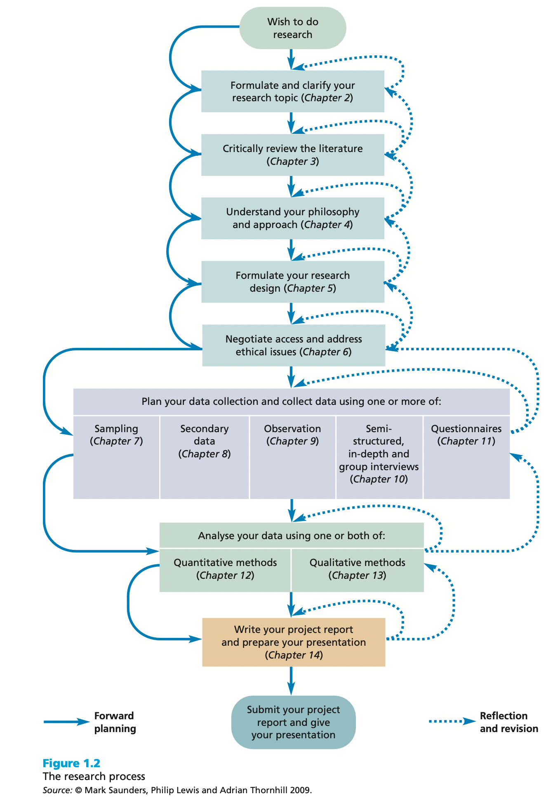

# What is research

When listening to the radio, watching the television or reading a daily newspaper it is difficult to avoid the term 'research'. The results of 'research' are all around us. A debate about the findings of a recent poll of people's opinions inevitably includes a discussion of 'research', normally referring to the way in which the data were collected. Politicians often justify their policy decisions on the basis of 'research'. Newspapers report the findings of research companies' surveys. Documentary programs tell us about 'research findings', and advertisers may highlight the 'results of research' to encourage you to buy a particular product or brand. However, we believe that what these examples really emphasizes is the wide range of meanings given to the term 'research' in everyday speech.

@walliman_your_2005 argues that many of these everyday uses of the term 'research' are not research in the true meaning of the word. As part of this, he highlights ways in which the term is used wrongly:

-   just collecting facts or information with no clear purpose;
-   reassembling and reordering facts or information without interpretation;
-   as a term to get your product or idea noticed and respected.

The first of these highlights the fact that, although research often involves the collection of information, it is more than just reading a few books or articles, talking to a few people or asking people questions. While collecting data may be part of the research process, if it is not undertaken in a systematic way, on its own and, in particular, with a clear purpose, it will not be seen as research. The second of these is commonplace in many reports. Data are collected, perhaps from a variety of different sources, and then assembled in a single document with the sources of these data listed. However, there is no interpretation of the data collected. Again, while the assembly of data from a variety of sources may be part of the process of research, without interpretation it is not research. Finally, the term 'research' can be used to get an idea or product noticed by people and to suggest that people should have confidence in it. In such instances, when you ask for details of the research process, these are either unclear or not forthcoming. [See @saunders_research_2019]

In short, research is a diligent search, studious inquiry or investigation or experimentation aimed at the discovery of new facts and findings; or broadly, it may relate to any subject of inquiry with regard to collection of information, interpretation of facts, revision of existing theories or laws in the light of new facts or practical ideas. [See @adams_research_2014]

Based upon this brief discussion we can already see that research has a number of characteristics:

-   Data are collected systematically.
-   Data are interpreted systematically.
-   There is a clear purpose: to find things out.

We can therefore define research as something that people undertake in order to find out things in a systematic way, thereby increasing their knowledge. Two phrases are important in this definition: 'systematic way' and 'to find out things'. 'Systematic' suggests that research is based on logical relationships and not just beliefs (@ghauri_research_2002). As part of this, your research will involve an explanation of the methods used to collect the data, will argue why the results obtained are meaningful, and will explain any limitations that are associated with them. 'To find out things' suggests there are a multiplicity of possible purposes for your research. These may include describing, explaining, understanding, criticizing and analyzing (@ghauri_research_2002). However, it also suggests that you have a clear purpose or set of 'things' that you want to find out, such as the answer to a question or number of questions [See @saunders_research_2019].

## Research method vs. research methodology

A research method is a way of conducting and implementing research. The term 'methods' refers to specific activities (e.g. designing questionnaire, conducting interviews, focus groups, observation etc.). On the other hand, research methodology is the science and philosophy behind all research. It is more about our attitude to and our understanding of research and the strategy or approach you choose to answer research questions.

## Why is research conducted

Research is conducted for a number of reasons, which in turn depend on the objectives of any particular 'research problem'. It may be to find out something we do not already know or to enhance our understanding of phenomena that we already know something about. In the business arena, however, research tends to be undertaken in order to achieve one or more of the following objectives [@saunders_research_2019]:

-   To gain a competitive advantage
-   To test new products and services
-   To solve a management/organisational problem
-   To provide information, which may help to avoid future business problems
-   To forecast future sales
-   To better understand shifts in consumer attitudes and tastes
-   To enhance profitability
-   To reduce operational costs
-   To enable the management to priorities strategic options for the future etc.

## Approaches to business and social research

Researchers usually handle numerous problems and apply research methods to obtain the best guess answers to their questions. They may use a single study or a combination of two designs. The investigator has to decide about the types and combinations of research forms that best serve the goals of the study. Broadly speaking, there are two main domains of research frequently observed in the literature, which are Quantitative research and Qualitative research. It is possible to combine quantitative and qualitative together to answer a single research question. Those approaches are known as mixed method research works. The diverse practices and uses of today's research practices are listed in the following paragraphs.

-   Quantitative research
-   Qualitative research
-   Pure theoretical research
-   Applied research
-   Longitudinal studies
-   Theory vs. empirical study

## The research process

{#fig-res_process}

## The hallmarks of scientific research

The hallmarks or main distinguishing characteristics of scientific research may be listed as follows (@bougie_research_2020):

-   Purposiveness
-   Rigor
-   Testability
-   Replicability
-   Precision and confidence
-   Objectivity
-   Generalizability
-   Parsimony

# Formulating and clarifying the research topic

## Attributes of a good research topic

*Capability: is it feasible?*

-   Is the topic something with which you are really fascinated?
-   Do you have, or can you develop within the project time frame, the necessary research skills to undertake the topic?
-   Is the research topic achievable within the available time?
-   Will the project still be current when you finish your project?
-   Is the research topic achievable within the financial resources that are likely to be available?
-   Are you reasonably certain of being able to gain access to data you are likely to require for this topic?

*Appropriateness: is it worthwhile?*

-   Does the topic fit the specifications and meet the standards set by the examining institution?
-   Does your research topic contain issues that have a clear link to theory?
-   Are you able to state your research question(s) and objectives clearly?
-   Will your proposed research be able to provide fresh insights into this topic?
-   Does your research topic relate clearly to the idea you have been given (perhaps by an organisation)?
-   Are the findings for this research topic likely to be symmetrical: that is, of similar value whatever the outcome?
-   Does the research topic match your career goals?

## Generating and refining research ideas

### Generating ideas

If you have not been given an initial research idea there is a range of techniques that can be used to find and select a topic that you would like to research. They can be thought of as those that are predominantly rational thinking and those that involve more creative thinking.

| Rational thinking                         | Creative thinking                                  |
|-------------------------------------------|----------------------------------------------------|
| Examining your own strenths and interests | Keeping a notebook of ideas                        |
| Looking at past project titles            | Exploring personal preferences using past projects |
| Discussion                                | Relevance trees/mindmap                            |
| Searching the literature                  | Brainstorming                                      |
| Scanning the media                        |                                                    |

: More frequently used techniques for generating and refining research ideas {#tbl-first}

### Refining research ideas

*The Delphi technique*

An additional approach that our students have found particularly useful in refining their research ideas is the Delphi technique. This involves using a group of people who are either involved or interested in the research idea to generate and choose a more specific research idea (@robson_real_2016). To use this technique you need:

-   to brief the members of the group about the research idea (they can make notes if they wish);
-   at the end of the briefing to encourage group members to seek clarification and more information as appropriate;
-   to ask each member of the group, including the originator of the research idea, to generate independently up to three specific research ideas based on the idea that has been described (they can also be asked to provide a justification for their specific ideas);
-   to collect the research ideas in an unedited and non-attributable form and to distribute them to all members of the group;
-   a second cycle of the process (steps 2 to 4) in which individuals comment on the research ideas and revise their own contributions in the light of what others have said;

*The preliminary study* To begin with, it is a good practice to do a prelimanry study to see if the idea/project is viable at all. It is often known as pilot study or proof-of-concept study. It is important to remember that a successful preliminry/pilot/study is not a guarantee for success. The result must be scalable to larger volume.

*Operational definition*

To formulate a research question, one must define the concepts involved very clearly. Consider this example, "An investigation on mobile entertainment pattern of youth adolescents in Germany". To begin with this research topic, the researcher must describe the operational definition of:

-   *mobile entertainment*: is it watching movies, youtube, listening music only?
-   *young adolescents*: what age group we are talking about?
-   *in Germany*: In whole Germany? Or the reseach will take place in a certain part of Germany?

## Turning research ideas into research projects

### Writing research questions

Defining research questions, rather like generating research ideas, is not a straightforward matter. It is important that the question is sufficiently involved to generate the sort of project that is consistent with the standards expected of you. A question that prompts a descriptive answer, for example 'What is the proportion of graduates entering the civil service who attended the old, established Germany universities?', is far easier to answer than: 'Why are graduates from old, established German universities more likely to enter the civil service than graduates from other universities?' More will be said about the importance of theory in defining the research question later in this section. However, beware of research questions that are too easy.

@clough_students_2012 use what they call the 'Goldilocks test' to decide if research questions are either 'too big', 'too small', 'too hot' or 'just right'. Those that are too big probably need significant research funding because they demand too many resources. Questions that are too small are likely to be of insufficient substance, while those that are too 'hot' may be so because of sensitivities that may be aroused as a result of doing the research. This may be because of the timing of the research or the many other reasons that may upset key people who have a role to play, either directly or indirectly, in the research context. Research questions that are 'just right', note @clough_students_2012, are those that are 'just right for investigation at this time, by this researcher in this setting'.

The pitfall that you must avoid at all costs is asking research questions that will not generate new insights. This raises the question of the extent to which you have consulted the relevant literature. It is perfectly legitimate to replicate research because you have a genuine concern about its applicability to your research setting (for example, your organisation). However, it certainly is not legitimate to display your ignorance of the literature.

@mcniff_action_2000 make the point that the research question may not emerge until the research process has started and is therefore part of the process of 'progressive illumination'. They note that this is particularly likely to be the case in practitioner action research.

| Research idea                           | General focus research questions                                                                               |
|-----------------------------------------|----------------------------------------------------------------------------------------------------------------|
| Advertisement and share price           | How does running of a TV advertising campaign designed to boost the image of a company affect its share price? |
| Job recruitment via the internet        | How effective is recruiting for new staff via the internet in comparison with traditional methods?             |
| The use of aromas as a marketing device | In what ways does the use of specific aromas in supermarkets affect buyer behavior?                            |
| The use of internet banking             | What effect has the growth of Internet banking had upon the uses customers make of branch facilities?          |

: Examples of research ideas and their derived focus research questions {#tbl-ex_res_ideas}

It is often a useful starting point in the writing of research questions to begin with one general focus research question that flows from your research idea. This may lead to several more detailed questions or the definition of research objectives. @tbl-ex_res_ideas has some examples of general focus research questions.

In order to clarify the research question @clough_students_2012 talk of the Russian doll principle. This means taking the research idea and 'breaking down the research questions from the original statement to something which strips away the complication of layers and obscurities until the very essence - the heart - of the question can be expressed ... just as the Russian doll is taken apart to reveal a tiny doll at the center @clough_students_2012.

| Research question                                               | Research objective                                                                                                                                                                          |
|-----------------------------------------------------------------|---------------------------------------------------------------------------------------------------------------------------------------------------------------------------------------------|
| Why have organisations introduced team briefing?                | To identify organisations' objective for team briefing schemes?                                                                                                                             |
| How can the effectiveness of team briefing schemes be measured? | To establish suitable effectiveness criteria for team briefing schemes                                                                                                                      |
| Has team briefing been effective?                               | To describe the extent to which the effectiveness criteria for team briefing have been met                                                                                                  |
| How can the effectiveness of team briefing be explained?        | \(a\) To determine the factors associated with the effectiveness criteria for team briefing being met (b) To estimate whether some of those factors are more influential that other factors |
| Can the explanation be generalized?                             | To develop an explanatory theory that associates certain factors with the effectiveness of team briefing schemes                                                                            |

: Phrasing research questions as research objectives {#tbl-ex_phrasing}

Your research may begin with a general focus research question that then generates more detailed research questions, or you may use your general focus research question as a base from which you write a set of research objectives. Objectives are more generally acceptable to the research community as evidence of the researcher's clear sense of purpose and direction. It may be that either is satisfactory. Do check whether your examining body has a preference. We contend that research objectives are likely to lead to greater specificity than research or investigative questions. @tbl-ex_phrasing illustrates this point. It summarizes the objectives of some research conducted by one of our students. Expression of the first research question as an objective prompted a consideration of the objectives of the

Ideally, the research objective should pass the so-called SMART test. That is the objectives should be:

\_ *Specific*: What precisely do you hope to achieve from undertaking the research?

\- *Measurable*: What measures will you use to determine whether you have achieved your objectives?

\- Achievable: Are the targets you have set for yourself achievable given all the possible constraints?

\- *Realistic*: Given all the other demands upon your time, will you have the time and energy to complete the research on time?

\- *Timely*: Will you have time to accomplish all your objectives in the time frame you have set?